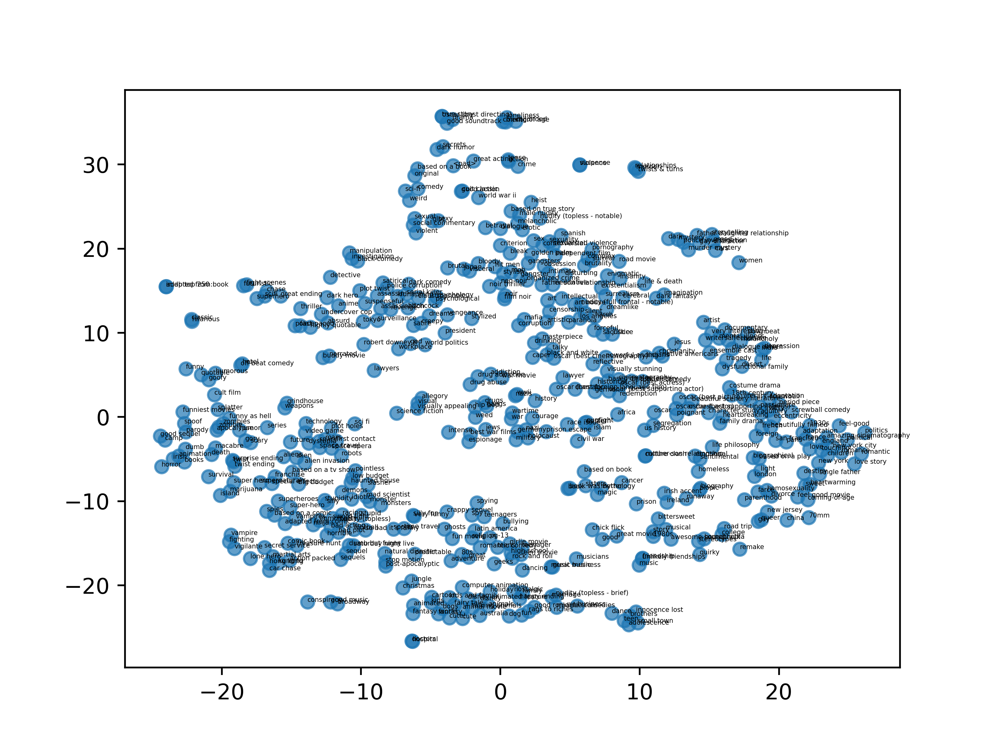

# UTPM
Code for paper: [Learning to Build User-tag Profile in Recommendation System](https://dl.acm.org/doi/abs/10.1145/3340531.3412719)

## Dataset
Download link: [MovieLens 20M](https://grouplens.org/datasets/movielens/20m/)
Create data folder, unzip and move the dataset into the folder

## Tag similarity query result
Here are some tag similarity search results based on the trained embedding vectors:
```
zombie -->
('zombie', 1.0000001), ('silly fun', 0.9775809), ('teens', 0.95186895), ('computer game', 0.92677987), ('coming-of-age', 0.88005877),

iraq war -->
('iraq war', 1.0), ('hostage', 0.9578194), ('iraq', 0.9440284), ('american civil war', 0.9411907), ('bombs', 0.93158925),

soccer -->
('soccer', 0.99999994), ('basketball', 0.95251715), ('race', 0.9486293), ('football', 0.9460438), ('racing', 0.92176306),

james bond -->
('james bond', 1.0000002), ('007', 0.9894815), ('007 (series)', 0.98517585), ('bond', 0.9691079), ('clones', 0.9312703),
```

## Tag & user embedding distribution
Use t-sne dimension reduction method to reduce the trained tag and user embeddings into 2D space, below is the tags' distribution.


## Precision@K (Currently cannot reproduce the result in paper.)
* precision@1: 6.95%
* precision@2: 5.28%
* precision@3: 4.10%

## Run the model
Create `pics` folder for saving t-sne embedding distribution pics. Run with default config `python main.py`

If you don't have GPU but want to see the result quickly, it is recommended to use a small (let's say 0.3) `user_frac` to make a sample of full users.

If everything is properly set, you should see outputs like the following:

```
epoch: 000 | step: 00000 | batch_loss: 6.6119 | epoch_avg_loss: 6.6119 | step_time: 0.35378
epoch: 000 | step: 00100 | batch_loss: 3.0183 | epoch_avg_loss: 4.4048 | step_time: 0.01175
epoch: 000 | step: 00200 | batch_loss: 5.4969 | epoch_avg_loss: 3.7021 | step_time: 0.01200
epoch: 000 | step: 00300 | batch_loss: 4.1210 | epoch_avg_loss: 3.3223 | step_time: 0.01197
epoch: 000 | step: 00400 | batch_loss: 1.5884 | epoch_avg_loss: 3.0219 | step_time: 0.01407
epoch: 000 | step: 00500 | batch_loss: 0.5027 | epoch_avg_loss: 2.7848 | step_time: 0.01389
epoch: 000 | step: 00600 | batch_loss: 3.1471 | epoch_avg_loss: 2.5947 | step_time: 0.00737
epoch: 000 | step: 00700 | batch_loss: 0.9000 | epoch_avg_loss: 2.4497 | step_time: 0.00798
......
```

To change the default config, pass arguments when launch main.py, check utils.py for arguments details.

