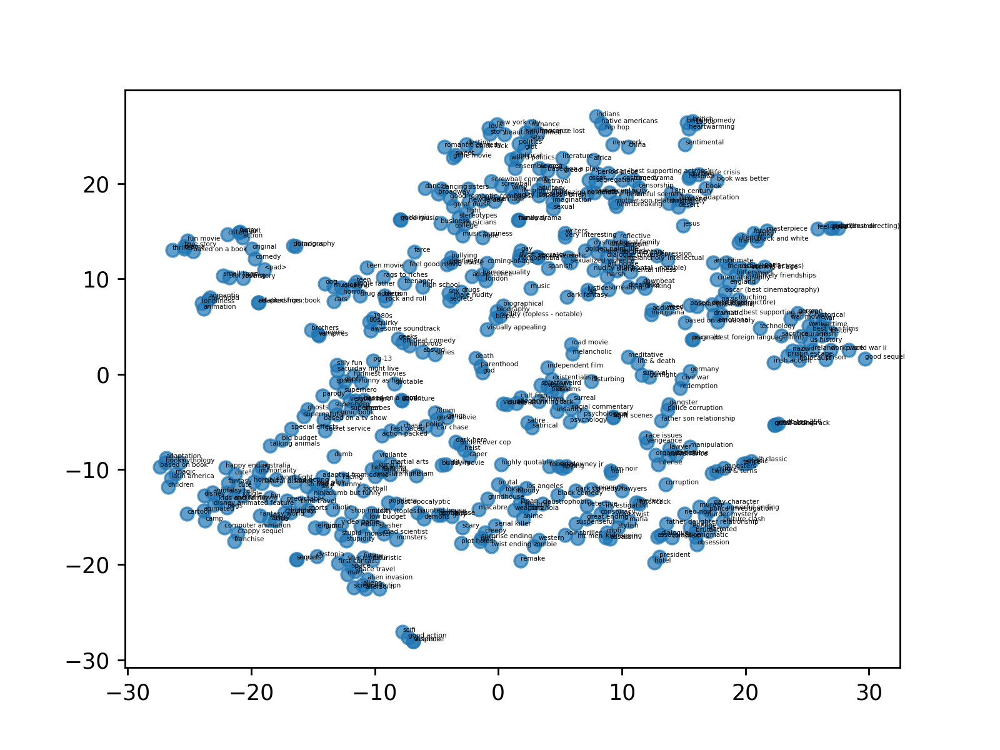
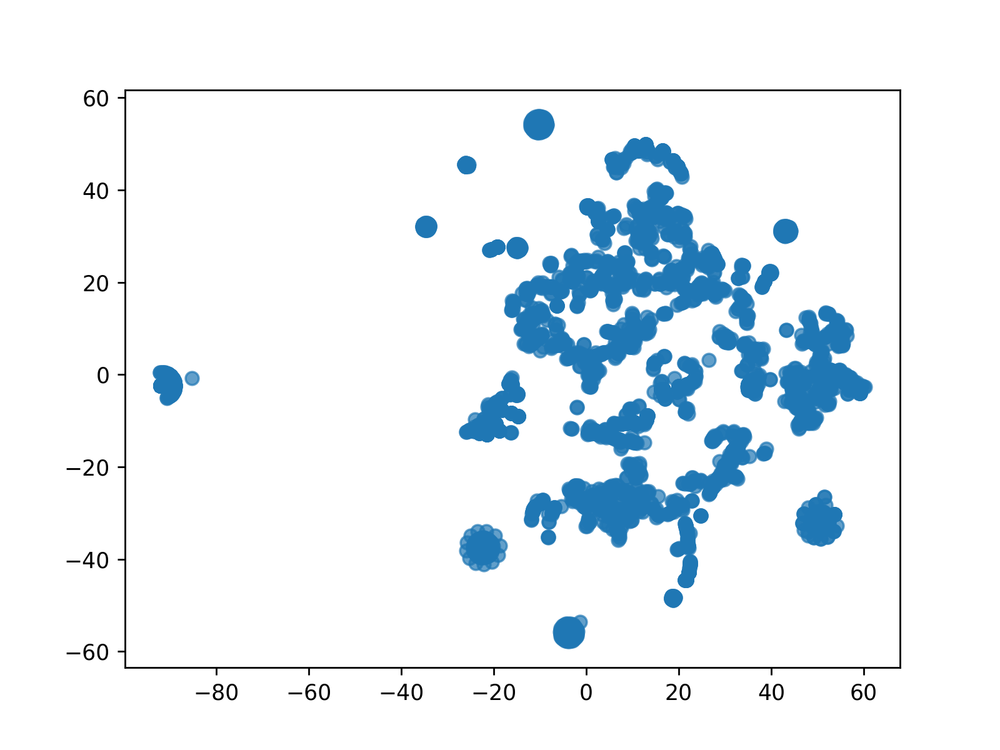

# UTPM
Code for paper: [Learning to Build User-tag Profile in Recommendation System](https://dl.acm.org/doi/abs/10.1145/3340531.3412719)

## Dataset
Download link: [MovieLens 20M](https://grouplens.org/datasets/movielens/20m/)
Create data folder, unzip and move the dataset into the folder

## Tag similarity query result
Here are some tag similarity search results based on the trained embedding vectors:
```
happy ending -->
         happy ending 1.0
         cute! 0.9432591
         fantasy 0.89542687
         cute 0.88582855
         fun 0.8504139
adaptation -->
         adaptation 0.9999999
         books 0.986031
         based on book 0.91810507
         mythology 0.88804483
         magic 0.8615897
book -->
         book 0.99999994
         island 0.8349991
         hospital 0.83032197
         book was better 0.82220745
         midlife crisis 0.80883765
book was better -->
         book was better 0.99999994
         book 0.82220745
         midlife crisis 0.8160943
         homophobia 0.8155084
         stereotypes 0.7798702
literature -->
         literature 0.9999999
         literary adaptation 0.88163626
         passionate 0.8808603
         18th century 0.8807162
         based on a play 0.86564
father son relationship -->
         father son relationship 0.9999999
         vengeance 0.80616903
         police corruption 0.79352015
         oscar (best foreign language film) 0.78094
         tragedy 0.77240366
storytelling -->
         storytelling 0.9999999
         small town 0.7059536
         love story 0.5919437
         romantic 0.53870004
         paris 0.53361225
```

## Tag & user embedding distribution
Use t-sne dimension reduction method to reduce the trained tag and user embeddings into 2D space, below is the tags' and users' distribution.



## Precision@K
Currently **cannot reproduce the result in paper**. I think the paper's data preprocess method (e.g. filter out some long-tail user / movie) is different with mine and this is crutial to the evaluation result. But we cannot find these details in the paper. So the gap still exists.

With `user_frac` set to 0.5:
* precision@1: 14.87%
* precision@2: 7.46%
* precision@3: 6.67%

## Run the model
Create `pics` folder for saving t-sne embedding distribution pics. Run with default config `python main.py`

If you don't have GPU but want to see the result quickly, it is recommended to use a small (let's say 0.3) `user_frac` to make a sample of full users.

If everything is properly set, you should see outputs like the following:

```
epoch: 000 | step: 00000 | batch_loss: 6.6119 | epoch_avg_loss: 6.6119 | step_time: 0.35378
epoch: 000 | step: 00100 | batch_loss: 3.0183 | epoch_avg_loss: 4.4048 | step_time: 0.01175
epoch: 000 | step: 00200 | batch_loss: 5.4969 | epoch_avg_loss: 3.7021 | step_time: 0.01200
epoch: 000 | step: 00300 | batch_loss: 4.1210 | epoch_avg_loss: 3.3223 | step_time: 0.01197
epoch: 000 | step: 00400 | batch_loss: 1.5884 | epoch_avg_loss: 3.0219 | step_time: 0.01407
epoch: 000 | step: 00500 | batch_loss: 0.5027 | epoch_avg_loss: 2.7848 | step_time: 0.01389
epoch: 000 | step: 00600 | batch_loss: 3.1471 | epoch_avg_loss: 2.5947 | step_time: 0.00737
epoch: 000 | step: 00700 | batch_loss: 0.9000 | epoch_avg_loss: 2.4497 | step_time: 0.00798
......
```

To change the default config, pass arguments when launch main.py, check utils.py for arguments details.

